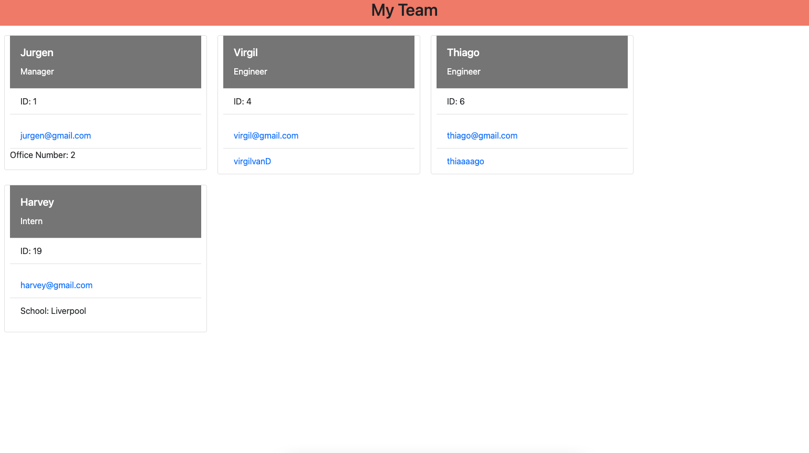

## Employee Tracker


The purpose of this command line application is to dynamically create a an HTML webpage so that a manager has quick access to their team's emails and GitHub profiles. 

## Table of Contents 

  * [Instalation](#installation)
  * [Screenshots/Visuals](#screenshots/visuals)
  * [Technology](#technology)
  * [Usage](#usage)
  * [License](#license)
  * [Contributing](#contributing)
  * [Tests](#tests)
  * [Questions](#questions)
  * [Credits](#credits)
  * [Link](#link)

## Installation 

In order to use this application, the user must first install the Node Package Manager (npm), Inquirer, and Jest to their command line.  

## Screenshots/Visuals



## Technology

The technologies used for this application were: JavaScript, Node, Inquirer, and Jest.

## Usage

After running ```node index.js ```user will be prompted with a series of questions in the terminal in order to create the webpage for their team.

## License

[MIT](https://choosealicense.com/licenses/mit/)

## Contributing 

If you would like to contribute please contact the owner of the repo or email to the address located in [Questions](#questions).

## Tests

There is no testing for this applications at this moment.

## Questions 

If you have any questions please email me at gareth.t.flynn@gmail.com

## Credits

[@garethtflynn](https://www.github.com/garethtflynn) 

## Link 

[GitHub Repository](https://github.com/garethtflynn/EmployeeTracker)


